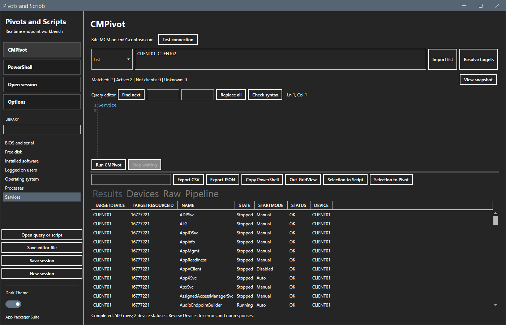
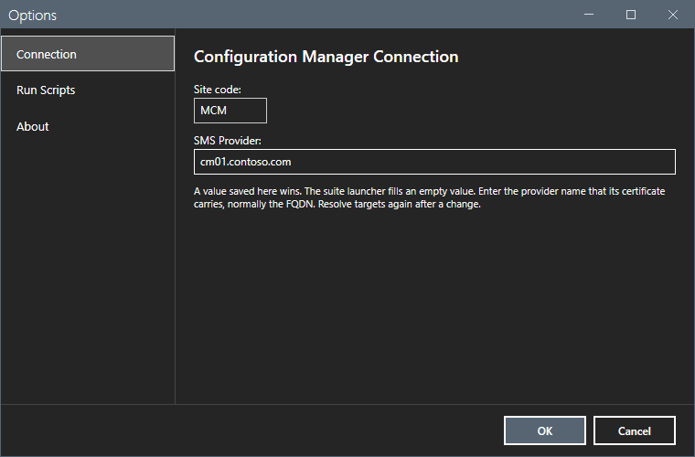
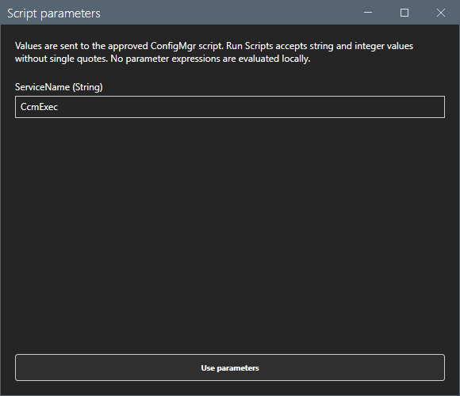
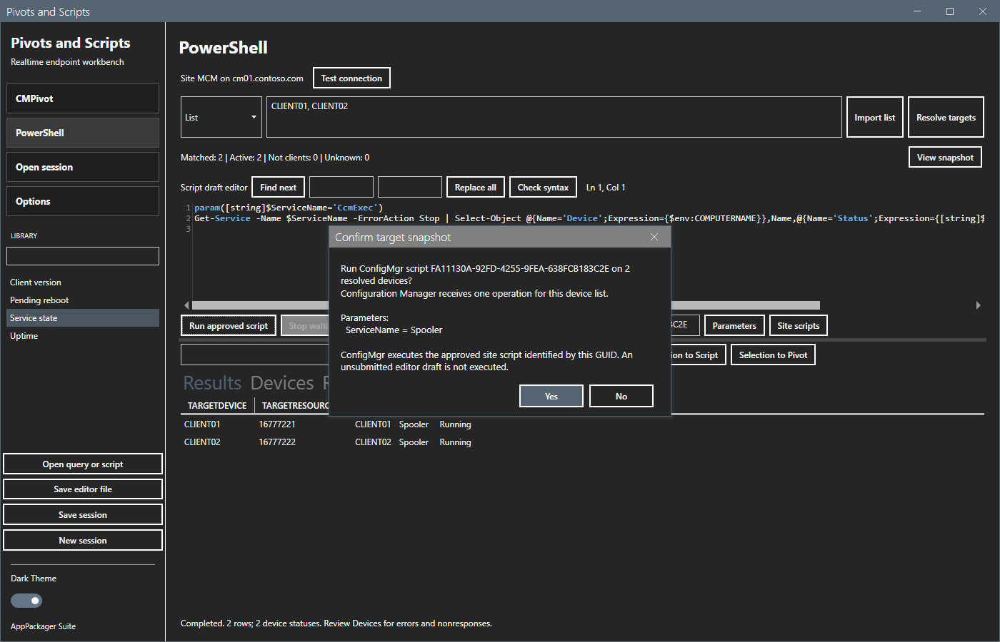
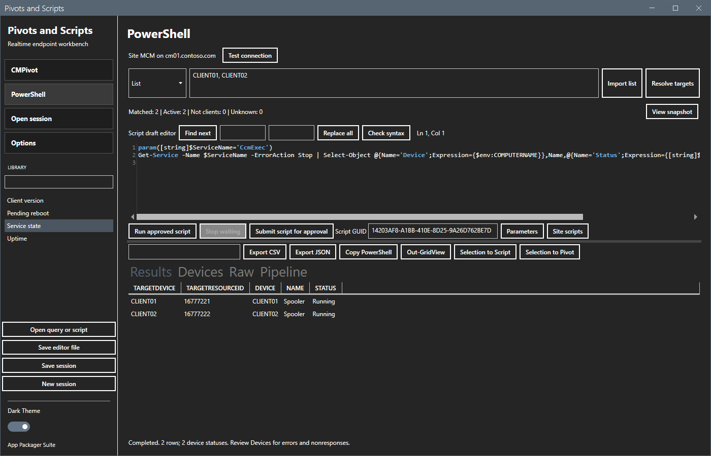
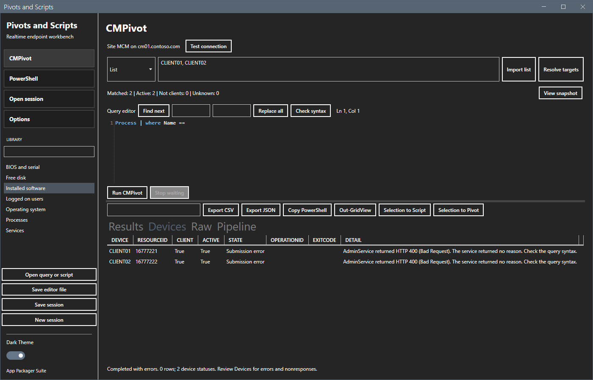
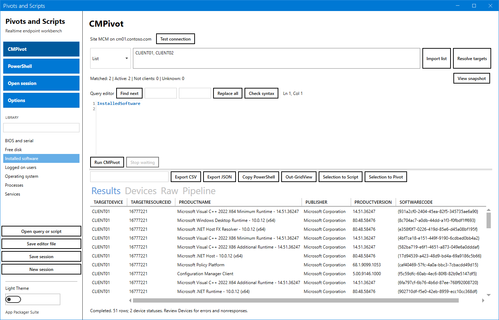

# Pivots and Scripts

[](https://github.com/jasonulbright/pivots-and-scripts/releases/latest)
[](https://github.com/jasonulbright/pivots-and-scripts/releases)
[](#prerequisites)
[](LICENSE)

A Configuration Manager workbench for realtime device investigation. Resolve a set of devices, run a CMPivot query or an approved Run Scripts script on them, inspect and export the results, then send the devices you selected to the next query or script. Every run is saved with its targets, parameters, raw responses and results. Built in Windows PowerShell 5.1. Part of the [AppPackager Suite](https://github.com/jasonulbright/app-packager-suite).



## Install

Install with the [AppPackager Suite](https://github.com/jasonulbright/app-packager-suite/releases/latest) installer, or download the release zip:

```powershell
curl.exe -Lso "$env:TEMP\pas.zip" https://github.com/jasonulbright/pivots-and-scripts/releases/latest/download/PivotsAndScripts.zip; Expand-Archive "$env:TEMP\pas.zip" "$env:LOCALAPPDATA\PivotsAndScripts" -Force
```

Each release also carries `checksums.txt` with the SHA-256 of both zips.

Start the app with `Launch.cmd`, or:

```powershell
powershell.exe -NoProfile -STA -File .\start-pivotsandscripts.ps1 -SiteCode MCM -SMSProvider cm01.contoso.com
```

## Prerequisites

- Windows PowerShell 5.1 and .NET Framework 4.8.
- The Configuration Manager console on the same computer. The app imports its `ConfigurationManager` module.
- CMPivot uses the administration service over HTTPS. The computer must trust the SMS Provider certificate. By default, the site binds a self-signed certificate issued by the `SMS Issuing` root; trust that root, or bind a PKI certificate. Enter the provider name that the certificate carries, normally the FQDN.
- Run Scripts results are read from the SMS Provider through WMI over DCOM.
- Permissions, from Microsoft Learn: CMPivot needs **Run CMPivot** on the collection and **Read** on **Inventory Reports**. Submitting a script needs **Create** on **SMS Scripts**. Running a script needs **Run Script** on the collection. Approving or denying a script needs **Approve** on **SMS Scripts**. Removing a script needs **Delete** on **SMS Scripts**.

The app uses your Windows identity. It stores no credentials.

## Usage

### Connect and resolve targets

Set the site code and the SMS Provider name in **Options > Connection**, then select **Test connection**. The window header shows the active connection. A value saved in Options wins. The suite launcher fills an empty value through `SUITE_CM_SITECODE` and `SUITE_CM_PROVIDER`. The `-SiteCode` and `-SMSProvider` command-line parameters override both for one session.



Resolve targets in one of four ways:

| Kind | Input |
|---|---|
| Collection | A collection ID such as `SMS00001`, or the exact collection name. |
| Device | One device name. Wildcard characters are literal. |
| Pattern | A device name with wildcards, for example `CLIENT*`. |
| List | Device names separated by commas, semicolons or lines. **Import** reads a TXT file, or a CSV file with a `Device` column. |

The target snapshot is fixed until you resolve again.

Each run is one operation in Configuration Manager, as in the console. For a collection target, the app sends the operation to the collection, and the site sends it to the members. For other targets, the app sends one operation for the device list. While it waits, the app reads the results of all devices with one request every 3 seconds. The Devices tab shows each device with its client and active state. Unknown names stay in the status line. Devices without a Configuration Manager client are skipped at run time and show **Not a client**.

### CMPivot

Open a query from the library, open a `.cmpivot` or `.kql` file, or type the query. **Ctrl+Space** opens the starter entities and operators. **Run CMPivot** asks for confirmation, then sends the query and shows results as each device answers. The administration service returns HTTP 400 without a reason for an invalid query; the device detail says to check the query syntax.

### Run Scripts

Run Scripts executes only scripts that Configuration Manager has approved. Configuration Manager enforces the approval rules; the app never changes hierarchy settings.

1. Write or open a script. **Check** validates the PowerShell syntax.
2. **Submit** creates the script in Configuration Manager. The app stores the parameter definitions from the `param()` block with the script, so the site can pass values to it. The script waits for approval.
3. Obtain approval. **Site scripts** lists the scripts on the site with state, author and approver. An account with **Approve** on **SMS Scripts** can approve or deny a script there, with a comment, or remove it. By default, the site does not let an author approve or deny their own script; the app shows that reason. Scripts that belong to a Configuration Manager feature, such as the built-in CMPivot script, are not listed and cannot be changed.
4. **Parameters** shows a field for each parameter, with its default value.
5. **Run approved script** lists the script GUID and the parameter values, then runs the approved site script on the targets. The editor text is not sent; changes after submission need a new submission and approval.

**Options > Run Scripts > Approve scripts after submission** approves each new script right after Submit. It is off by default. It works only where the site lets authors approve their own scripts; Microsoft recommends that setting only in a lab. When the site refuses, the script stays waiting for approval and the status line shows the reason.

Parameter rules, from the Run Scripts feature:

- Only string and integer parameters work. The site refuses switch parameters. Submit refuses switch, bool and other types.
- A value cannot contain a single quote. The client script fails on it.
- A script holds at most 10 parameters.
- The site drops values for names it does not define. The app refuses such names before submission. A script created without parameter definitions cannot receive values; the app says so.
- Script output is limited to 4 KB per device. Return compact JSON with `ConvertTo-Json -Compress`; the app splits JSON output into result columns.

The Devices tab shows **Script failed** with the exit code when a script fails on a device.







### Results

| Tab | Content |
|---|---|
| Results | One row per result, with `TargetDevice` and `TargetResourceID`. Filter, sort and reorder columns. |
| Devices | Each device with state, operation ID, exit code and error detail. |
| Raw | The submit and result records from the site. |
| Pipeline | Each step of the session with its final state. |

Export the visible rows to CSV or JSON, copy them as a PowerShell command that rebuilds the objects, or open them in Out-GridView. CSV export prefixes values that start with `=`, `+`, `-` or `@` with `'`, so a spreadsheet does not run them as formulas.

Select result rows and choose **Selection to Pivot** or **Selection to Script** to target only those devices in the next step.





**Stop waiting** stops local submission and polling. Operations that the site already received can still run on devices. A device without a result after 300 seconds shows **No response within timeout**; the device can still run the operation. On the site, a script run times out after one hour. Closing the window during a run stops waiting first; close again when the worker ends.

## Storage

Queries and scripts are ordinary files in `Library\` or any folder you choose. Preferences, window position and sessions are stored in `%LOCALAPPDATA%\SignalRidgeLabs\PivotsAndScripts`. A session is saved before the first operation is sent. Each step records the query or script text and hash, operator, site, provider, parameters, targets, timestamps, raw responses, device states and results. **Open session** opens a saved session; it does not run anything again.

## Limits

- A collection target runs on the members at the time of the run. Members added after Resolve also answer and appear in the results.
- There is no scheduler, no automatic script cleanup and no remediation pipeline.
- Editor completion is a starter word list.

## Project structure

| Path | Content |
|---|---|
| `start-pivotsandscripts.ps1` | WPF shell. |
| `MainWindow.xaml` | Window layout. |
| `Module\PivotsAndScripts.psm1` | Targets, administration service calls, Run Scripts calls, parameter definitions, result normalization. |
| `Module\Execute.ps1` | Background worker for connect, resolve, submit and run. |
| `Module\ParameterDialog.ps1` | Script parameter dialog. |
| `Library\` | CMPivot queries and scripts. |
| `Lib\` | MahApps.Metro, ControlzEx, XAML Behaviors, AvalonEdit, and the vendored suite module `SuiteCommon`. |
| `Tests\` | Pester 5 tests. |

## Tests

```powershell
powershell.exe -NoProfile -Command "Import-Module Pester -MinimumVersion 5.0; Invoke-Pester -Path .\Tests"
```

The tests include a window smoke test. Run them under Windows PowerShell 5.1.

## References

- [Administration service usage, CMPivot endpoints](https://learn.microsoft.com/intune/configmgr/develop/adminservice/usage)
- [Set up the administration service, certificates](https://learn.microsoft.com/intune/configmgr/develop/adminservice/set-up)
- [Create and run PowerShell scripts](https://learn.microsoft.com/intune/configmgr/apps/deploy-use/create-deploy-scripts)
- [Invoke-CMScript](https://learn.microsoft.com/powershell/module/configurationmanager/invoke-cmscript)
- [New-CMScript](https://learn.microsoft.com/powershell/module/configurationmanager/new-cmscript)

## License

This project is licensed under the [MIT License](LICENSE). Third-party library licenses are in `Lib\`.

## Author

Jason Ulbright
